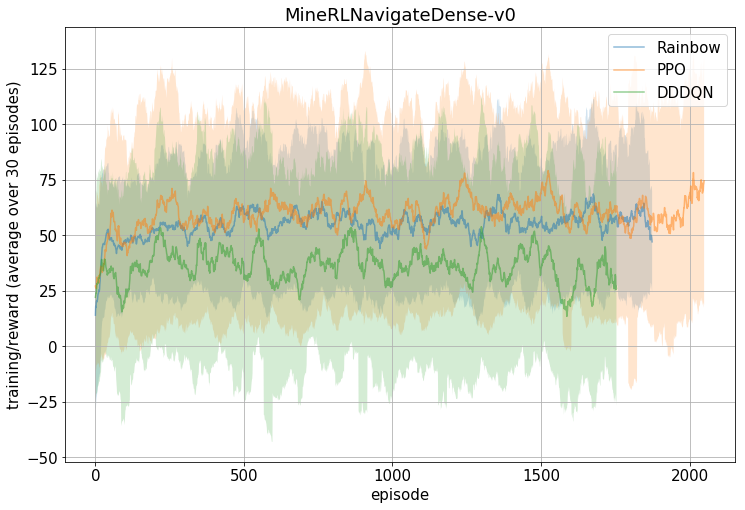

dummy line
# MineRL Competition's baseline implementation with ChainerRL

Starter kit for [MineRL](https://github.com/minerllabs/minerl)
Competition with [ChainerRL](https://github.com/chainer/chainerrl).

# Resources

- [MineRL](https://github.com/minerllabs/minerl)
  - [Competition page](https://www.aicrowd.com/challenges/neurips-2019-minerl-competition)
  - [docs](http://minerl.io/docs/)
  - [competition proposal paper](https://arxiv.org/abs/1904.10079)
- [ChainerRL](https://github.com/chainer/chainerrl)
- [Chainer](https://chainer.org/)

# Installation

```sh
git clone <URL-for-this-repo>  # FIXME
cd quickstart/chainerrl_baselines
pip install -r requirements.txt
```

See [MineRL installation](https://github.com/minerllabs/minerl#installation) and
[ChainerRL installation](https://github.com/chainer/chainerrl#installation) for more information.

# Getting started

- [baselines/dddqn.sh]
    - Double Dueling DQN (DDDQN), which mirrors the original implementation and hyperparameters described in [competition proposal paper](https://arxiv.org/abs/1904.10079) (code: [here](https://github.com/minerllabs/minerl/blob/master/tests/excluded/navigate_dqn_test.py) and [here](https://github.com/minerllabs/minerl/blob/master/tests/excluded/treechop_dqn_test.py)).
- [baselines/rainbow.sh]
    - Rainbow
- [baselines/ppo.sh]
    - PPO

# Experimental results of DDDQN/Rainbow/PPO

Charts below show the *training* reward curves for each algorithm with prior knowledge of action/observation space.

For the exact hyper parameters we used, see each script on "Getting started" section and the corresponding Python script
(`baselines/dqn_family.py`, `baselines/ppo.py`).

## MineRLTreechop-v0


Figure above shows the training phase scores on `MineRLTreecho-v0` task.
Each algorithm is independently trained for 3 times (trials), and the error area corresponds to the standard deviation (not the standard error) over 3 trials score.
The chart is also averaged over 30 episodes for visibility.

Rainbow and PPO achieves better results than DDDQN.  

[The MineRL competition's original paper](https://arxiv.org/abs/1904.10079) reports the score of DDDQN (refered as "DQN" in the paper) as 3.73 +- 0.61, which is consistent with our result. (Our result is slightly better than the original though)

Note: for fair comparison, the x-axis does not represent "timestep", but "episode". (because Rainbow and PPO use "frameskip" strategy while DDDQN follows the original paper's settings (no frameskipping)).


## MineRLNavigateDense-v0



For `MineRLNavigateDense`, DDDQN achieves comparable score with Rainbow/PPO.

[The MineRL competition's original paper](https://arxiv.org/abs/1904.10079) reports the score of DDDQN (refered as "DQN" in the paper) as 55.59 +- 11.38, which is consistent with our result. (Our result is slightly worse than the original though)


## MineRLNavigate-v0


No algorithm could solve the `MineRLNavigate-v0` (sparse reaward task).
In order to solve sparse environments, one needs to hack ordinal RL algorithms with reaward shaping or smart exploration (namely, transfer learning from dense tasks or utilize expert trajectories) etc.


## MineRLObtainDiamond-v0

`MineRLObtainDiamond-v0` is the ultimate goal for this competition, but the baselines described bolew never solved this.
The action space shaping strategy we tried for this task is described in "Exclusive actions" sections.


## Prior knowledge for action/observation spaces

On `MineRLTreechop-v0`, `MineRLNavigateDense-v0` and `MineRLNavigate-v0`, Rainbow/PPO/DDDQN shape the action/observation space based on prior knowledge.  
The original idea of this prior knowledge came from [MineRL competition proposal paper](https://arxiv.org/abs/1904.10079)'s implementation
([Treechop](https://github.com/minerllabs/minerl/blob/master/tests/excluded/treechop_dqn_test.py),
[Navigate](https://github.com/minerllabs/minerl/blob/master/tests/excluded/navigate_dqn_test.py)).

The action spaces for MineRL environments are defined as OpenAI Gym's `Dict` space.
The set of space keys is different among tasks, but some of them are common
(namely, `forward`, `back`, `left`, `right`, `jump`, `sneak`, `sprint`, `attack` and `camera`).

`env_wrappers.SerialDiscreteActionWrapper` is the corresponding code for shaping the action space.

### Discretizing

The only action key which is continuous is `camera`.
`camera` is discretized into two-kinds action (PPO does not require discrete action space though):

```python
[(0, -10), (0, 10)]
```

### Disabling

Some of actions are disabled based on the task's characteristic.

There are two types of disabling.
`--always-keys` specifies actions which is always triggered throughout interaction with the environment.
These actions are removed from agent's action choice.

Actions specified as `--exclude-keys` are simply disabled and they will be never triggered.

On `MineRLTreechop-v0`, `--always-keys` is `attack` and `--exclude-keys` are `back`, `left`, `right`, `sneak`, `sprint`.  
On `MineRLNavigate-v0` / `MineRLNavigateDense-v0`, `--always-keys` are `forward`, `sprint`, `attack`
and `--exclude-keys` are `back`, `left`, `right`, `sneak` and `place`.

### Serializing

After discretizing and disabling, `Dict` action space is flattened and converted into one `Discrete` action space.  
And the resulting space is "serialized", that is, agents can choose only one of the action on the flattened action space
(the agent can push only one button of the gamepad in same time).

### (Reversing)

On Treechop, `forward` key is reversed. (`--reverse-keys forward`)  
Reversed keys are similar to the `--always-keys` actions, but they are not removed from agent's action choice.
Corresponding gamepad buttons for reversed actions are always pushed, but agent can choose to trigger the button off as one of the action.

### Exclusive actions

For Obtain* tasks, we employ "weak" action prior knowledge instead of prior knowledge described above.
It does not have `--always-keys`/`--exclude-keys`/`--reverse-keys` option,
but "exclusive" (or, "conflicting") actions are merged.

`forward` and `back` actions are exclusive, since they conflicts each other and pushing them at same time makes no sense.
They are merged and renamed as `forward_back` action with Discrete(3).  
(Original: forward 0/1, back 0/1. Merged: noop/forward/back)

List of exclusive actions we used:
  - `forward` / `back`
  - `right` / `left`
  - `sneak` / `sprint`
  - `attack` / `place` / `equip` / `craft` / `nearbyCraft` / `nearbySmelt`

See `env_wrappers.CombineActionWrapper` for more detail.

### Summary

Resulting action spaces after shaped with prior knowledge are:

- Treechop: Discrete(5)
- Navigate/NavigateDense: Discrete(6)
- Obtain*: Discrete(36)
