# MineRL Competition's baseline implementation with ChainerRL

**Note**:  
For experiments, we used **MineRL v0.2.3**, which is the latest as of September 30, 2019.

This repository contains a set of baselines implementations to help you get started with the [MineRL](https://github.com/minerllabs/minerl) competition. These implementations were adapted from  [ChainerRL](https://github.com/chainer/chainerrl) and use [Chainer](https://chainer.org/).

# Resources
- [MineRL](https://github.com/minerllabs/minerl)
  - [Competition page](https://www.aicrowd.com/challenges/neurips-2019-minerl-competition)
  - [Documentation](http://minerl.io/docs/)
  - [Competition Proposal Paper](https://arxiv.org/abs/1904.10079)
- [ChainerRL](https://github.com/chainer/chainerrl)
- [Chainer](https://chainer.org/)

# Installation

```sh
git clone git@github.com:minerllabs/baselines.git
cd baselines/general/chainerrl
pip install -r requirements.txt
```

See [MineRL installation](https://github.com/minerllabs/minerl#installation) and
[ChainerRL installation](https://github.com/chainer/chainerrl#installation) for more information.

# Getting started

### Dataset download
- In order to run the Behavoral Cloning, GAIL and DQfD agents, you need to download expert dataset into an appropriate location (by default, `baselines/expert_dataset`).
### Training
- [baselines/dddqn.sh]
    - Double Dueling DQN (DDDQN), with implementation and hyperparameters as described in the [proposal paper](https://arxiv.org/abs/1904.10079) (code: [here](https://github.com/minerllabs/minerl/blob/master/tests/excluded/navigate_dqn_test.py) and [here](https://github.com/minerllabs/minerl/blob/master/tests/excluded/treechop_dqn_test.py)).
- [baselines/rainbow.sh]
    - Rainbow
- [baselines/ppo.sh]
    - PPO
- [baselines/behavoral_cloning.sh]
    - Behavoral Cloning (BC)
- [baselines/gail.sh]
    - GAIL
- [baselines/dqfd.sh]
    - DQfD

# Overview of experimental results of DDDQN/Rainbow/PPO/BC/GAIL/DQfD

|                    | use trajectory dataset? | Treechop           | Navigate         | NavigateDense      |
| :---               | :---                    | ---:               | ---:             | ---:               |
| (paper) DDDQN      | No                      | 3.73 +- 0.61       | 0.00 +- 0.00     | 55.59 +- 11.38     |
| (paper) A2C        | No                      | 2.61 +- 0.50       | 0.00 +- 0.00     | -0.97 +- 3.32      |
| (paper) BC         | Yes                     | 0.75 +- 0.39       | 4.23 +- 4.15     | 5.57 +- 6.00       |
| (paper) PreDQN     | Yes                     | 4.16 +- 0.82       | 6.00 +- 4.65     | **94.96 +- 13.42** |
| (**ours**) DDDQN   | No                      | 5.28 +- 2.87       | 4.0 +- 19.60     | 59.13 +- 52.43     |
| (**ours**) Rainbow | No                      | **62.44 +- 2.74**  | 13.0 +- 33.63    | 66.89 +- 41.24     |
| (**ours**) PPO     | No                      | 56.31 +- 8.31      | 8.0 +- 27.13     | 87.83 +- 59.46     |
| (**ours**) BC      | Yes                     | 9.27 +- 5.21       | 46.00 +- 50.1    | 69.54 +- 57.02     |
| (**ours**) GAIL    | Yes                     | 16.34 +- 6.85      | 32.00 +- 46.88   | 59.32 +- 30.60     |
| (**ours**) DQfD    | Yes                     | **62.37 +- 2.16**  | 6.00 +- 23.75    | not evaluated      |
| (paper) Human      | -                       | 64.00 +- 0.00      | 100.00 +- 0.00   | 164.00 +- 0.00     |
| (paper) Random     | -                       | 3.81 +- 0.57       | 1.00 +- 1.95     | -4.37 +- 5.10      |

Table 1: (for "paper") Results over the best 100 contiguous episodes. +- denotes standard deviation.  
(for "ours") Results over the best 100 contiguous episodes among three trials (for GAIL in Navigate tasks, two trials instead). +- denotes standard deviation.
We do not emphasize the best performance for Navigate since the standard deviation is very large, however the performance of BC/GAIL seems to be better.  
See Table 1 of [proposal paper](https://arxiv.org/abs/1904.10079) for more information.  

For experiments, we used **MineRL v0.2.3**, which is the latest as of September 30, 2019.


# Experimental results of DDDQN/Rainbow/PPO

The figures below show the *training* reward graphs for each of DDDQN/Rainbow/PPO with task-specific prior knowledge used to shape the action and observation space.

The exact hyperparameters used for each algorithm can be found from the links in the "Getting Started" section and their corresponding Python scripts (`baselines/dqn_family.py`, `baselines/ppo.py`).


## MineRLTreechop-v0

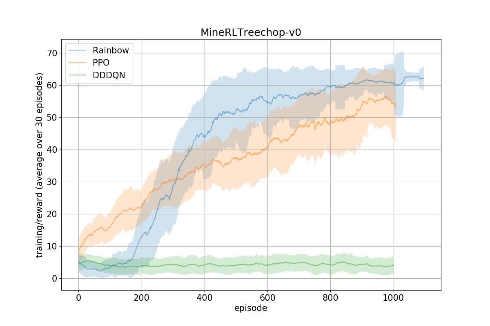

The figure above shows the performance of the algorithms during the training phase on the `MineRLTreechop-v0` task.
Each algorithm is independently trained 3 times (trials), and the shaded area represents the standard deviation (not the standard error) over the score of the three trials
The curves are smoothed by taking an average over 30 episodes for visibility.

Rainbow and PPO outperform DDDQN.

[The MineRL competition's original paper](https://arxiv.org/abs/1904.10079) reports the score of DDDQN (referred to as "DQN" in the paper) as 3.73 +- 0.61, which is consistent with our result. (Our result is slightly better than the original)

Note: for a fair comparison, the x-axis does not represent "timestep", but "episode". (because Rainbow and PPO use "frameskip" strategy while DDDQN follows the paper's settings (no frame skipping)).

Videos of trained agents during their last evaluation round:
- [Rainbow trial 1 (reward 62.0)](static/release20190926_v23_rainbow_ppo_dddqn/RainbowTreechop1.mp4)
- [Rainbow trial 2 (reward 63.0)](static/release20190926_v23_rainbow_ppo_dddqn/RainbowTreechop2.mp4)
- [Rainbow trial 3 (reward 63.0)](static/release20190926_v23_rainbow_ppo_dddqn/RainbowTreechop3.mp4)
- [PPO trial 1 (reward 63.0)](static/release20190926_v23_rainbow_ppo_dddqn/PPOTreechop1.mp4)
- [PPO trial 2 (reward 46.0) ](static/release20190926_v23_rainbow_ppo_dddqn/PPOTreechop2.mp4)
- [PPO trial 3 (reward 58.0)](static/release20190926_v23_rainbow_ppo_dddqn/PPOTreechop3.mp4)
- [DDDQN trial 1 (reward 0.0)](static/release20190926_v23_rainbow_ppo_dddqn/DDDQNTreechop1.mp4)
- [DDDQN trial 2 (reward 1.0)](static/release20190926_v23_rainbow_ppo_dddqn/DDDQNTreechop2.mp4)
- [DDDQN trial 3 (reward 0.0)](static/release20190926_v23_rainbow_ppo_dddqn/DDDQNTreechop3.mp4)

  
Rainbow trial 3 first 100 frames of the last evaluation episode

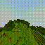  
PPO trial 2 first 100 frames of the last evaluation episode

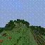  
DDDQN trial 2 first 100 frames of the last evaluation episode


## MineRLNavigateDense-v0

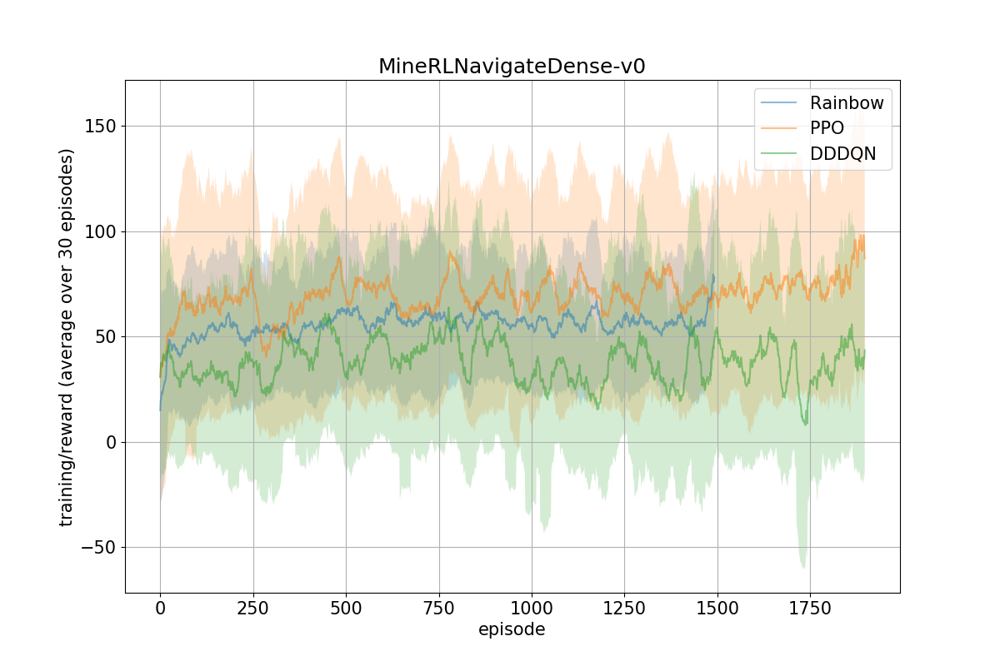

For `MineRLNavigateDense`, DDDQN achieves a score comparable to Rainbow/PPO.

[The MineRL competition's original paper](https://arxiv.org/abs/1904.10079) reports the score of DDDQN (referred as "DQN" in the paper) as 55.59 +- 11.38, which is consistent with our result. (Our result is slightly worse than the original)

Videos of trained agents during their last evaluation round:
- [Rainbow trial 1 (reward 6.8)](static/release20190926_v23_rainbow_ppo_dddqn/RainbowNavigateDense1.mp4)
- [Rainbow trial 2 (reward 67.4)](static/release20190926_v23_rainbow_ppo_dddqn/RainbowNavigateDense2.mp4)
- [Rainbow trial 3 (reward 33.1)](static/release20190926_v23_rainbow_ppo_dddqn/RainbowNavigateDense3.mp4)
- [PPO trial 1 (reward 41.6)](static/release20190926_v23_rainbow_ppo_dddqn/PPONavigateDense1.mp4)
- [PPO trial 2 (reward 56.7)](static/release20190926_v23_rainbow_ppo_dddqn/PPONavigateDense2.mp4)
- [PPO trial 3 (reward 159.1)](static/release20190926_v23_rainbow_ppo_dddqn/PPONavigateDense3.mp4)
- [DDDQN trial 1 (reward 42.9)](static/release20190926_v23_rainbow_ppo_dddqn/DDDQNNavigateDense1.mp4)
- [DDDQN trial 2 (reward 4.0)](static/release20190926_v23_rainbow_ppo_dddqn/DDDQNNavigateDense2.mp4)
- (NA) DDDQN trial 3

  
Rainbow trial 1 first 100 frames of the last evaluation episode

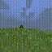  
PPO trial 3 first 100 frames of the last evaluation episode

  
DDDQN trial 2 first 100 frames of the last evaluation episode


## MineRLNavigate-v0


No algorithm could solve the `MineRLNavigate-v0` (a sparse reward task). Given the difficulties of utilizing RL algorithms for sparse reward tasks, we posit the need for additional methods such as reward shaping, smarter exploration strategies, utilizing expert trajectories, etc.

Videos of trained agents during their last evaluation round:
- [Rainbow trial 1 (reward 0.0)](static/release20190926_v23_rainbow_ppo_dddqn/RainbowNavigate1.mp4)
- [Rainbow trial 2 (reward ?)](static/release20190926_v23_rainbow_ppo_dddqn/RainbowNavigate2.mp4)
- [Rainbow trial 3 (reward 0.0)](static/release20190926_v23_rainbow_ppo_dddqn/RainbowNavigate3.mp4)
- [PPO trial 1 (reward 0.0)](static/release20190926_v23_rainbow_ppo_dddqn/PPONavigate1.mp4)
- [PPO trial 2 (reward 0.0)](static/release20190926_v23_rainbow_ppo_dddqn/PPONavigate2.mp4)
- [PPO trial 3 (reward 100.0)](static/release20190926_v23_rainbow_ppo_dddqn/PPONavigate3.mp4)
- [DDDQN trial 1 (reward ?)](static/release20190926_v23_rainbow_ppo_dddqn/DDDQNNavigate1.mp4)
- [DDDQN trial 2 (reward 0.0)](static/release20190926_v23_rainbow_ppo_dddqn/DDDQNNavigate2.mp4)
- [DDDQN trial 3 (reward ?)](static/release20190926_v23_rainbow_ppo_dddqn/DDDQNNavigate3.mp4)

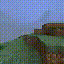  
Rainbow trial 3 first 100 frames of the last evaluation episode

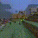  
PPO trial 3 first 100 frames of the last evaluation episode

  
DDDQN trial 2 first 100 frames of the last evaluation episode


## MineRLObtainDiamond-v0

`MineRLObtainDiamond-v0` is the ultimate goal for this competition. None of the baselines discussed above were able to solve this task.

*Important notice*: the action space shaping strategy we tried for this task is different from
`MineRLTreechop-v0`, `MineRLNavigateDense-v0` or `MineRLNavigate-v0`.
The detail is described in the "Exclusive actions" section below.


## Prior knowledge of action/observation spaces for Rainbow/PPO/DDDQN

For `MineRLTreechop-v0`, `MineRLNavigateDense-v0` and `MineRLNavigate-v0`, **Rainbow/PPO/DDDQN** shapes the action/observation space based on prior domain knowledge about the tasks.
This shaping was inspired by the [MineRL competition proposal paper's](https://arxiv.org/abs/1904.10079) implementations
([Treechop](https://github.com/minerllabs/minerl/blob/master/tests/excluded/treechop_dqn_test.py),
[Navigate](https://github.com/minerllabs/minerl/blob/master/tests/excluded/navigate_dqn_test.py)).

The action spaces for MineRL environments are defined using OpenAI Gym's `Dict` space.
The set of action_space keys are different among tasks, but some of them are common throughout
(namely, `forward`, `back`, `left`, `right`, `jump`, `sneak`, `sprint`, `attack` and `camera`).

`env_wrappers.SerialDiscreteActionWrapper` is the corresponding code for shaping the action space.

The following sections describe the various strategies we employed in the shaping of the action space.

### Discretizing

The only action key which is continuous is `camera`.
`camera` is discretized into two-kinds action (For DDDQN and Rainbow. PPO does not require a discrete action space):

```python
[(0, -10), (0, 10)]
```

### Disabling

Actions deemed unnecessary for the corresponding task were disabled.

There are two types of disabling.
`--always-keys` specifies actions which are always triggered throughout the episode.
These actions are removed from the agent's action choice.

Actions specified as `--exclude-keys` are simply disabled and they will be never triggered.

For example,
On `MineRLTreechop-v0`,
  - `--always-keys`: `attack`
  - `--exclude-keys`: `back`, `left`, `right`, `sneak`, `sprint`

On `MineRLNavigate-v0` / `MineRLNavigateDense-v0`
  - `--always-keys`: `forward`, `sprint`, `attack`
  - `--exclude-keys`: `back`, `left`, `right`, `sneak`, `place`

### Serializing

After discretizing and disabling, the `Dict` action space is flattened and converted into a single `Discrete` action space.  
The resulting space is "serialized", i.e: agents can choose only one of the action on the flattened action space
(the agent can push only one button of the gamepad at a step).

### (Reversing)

On Treechop, `forward` key is reversed. (`--reverse-keys forward`)  
Reversed keys are similar to the `--always-keys` actions, but they are not removed from the agent's action choice.
Corresponding gamepad buttons for reversed actions are always pushed, but the agent can choose to trigger the button off as one of the action.

### Exclusive actions

For the `Obtain*` tasks, we employ "weak" action prior knowledge instead of prior knowledge described above.
It does not have `--always-keys`/`--exclude-keys`/`--reverse-keys` option,
but "exclusive" (or, "conflicting") actions are merged.

For example,
`forward` and `back` actions are exclusive since they conflict each other and pushing them at the same time makes no sense.
They are merged and renamed as `forward_back` action with Discrete(3).  
(Original: forward 0/1, back 0/1. Merged: noop/forward/back)

List of exclusive actions we used:
  - `forward` / `back`
  - `right` / `left`
  - `sneak` / `sprint`
  - `attack` / `place` / `equip` / `craft` / `nearbyCraft` / `nearbySmelt`

See `env_wrappers.CombineActionWrapper` for more detail.

### Summary

Resulting action spaces after shaped with prior knowledge are:

- Treechop: `Discrete(5)`
  1. (noop) `{'forward': 1, 'jump': 0, 'camera': [0, 0]}`
  2. `{'forward': 0, 'jump': 0, 'camera': [0, 0]}`
  3. `{'forward': 1, 'jump': 1, 'camera': [0, 0]}`
  4. `{'forward': 1, 'jump': 0, 'camera': [0, -10]}`
  5. `{'forward': 1, 'jump': 0, 'camera': [0, 10]}`  
  Note that `attack` is always `1` and `back`, `left`, `right`, `sneak`, `sprint` are always `0`.
- Navigate/NavigateDense: `Discrete(4)`
  1. (noop) `{'jump': 0, 'camera': [0, 0]}`
  2. `{'jump': 1, 'camera': [0, 0]}`
  3. `{'jump': 0, 'camera': [0, -10]}`
  4. `{'jump': 0, 'camera': [0, 10]}`  
  Note that `forward`, `sprint`, `attack` are always `1` and `back`, `left`, `right`, `sneak`, `place` are always `0`.
- Obtain*: `Discrete(36)`

# Experimental results of BC/GAIL

The figures below show the *training* reward graphs for both BC and GAIL along with the criteria used to process the expert dataset.

The exact hyperparameters used for each algorithm can be found from the links in the "Getting Started" section and their corresponding Python scripts (`baselines/behavoral_cloning.py`, `baselines/gail.py`).

## MineRLTreechop-v0

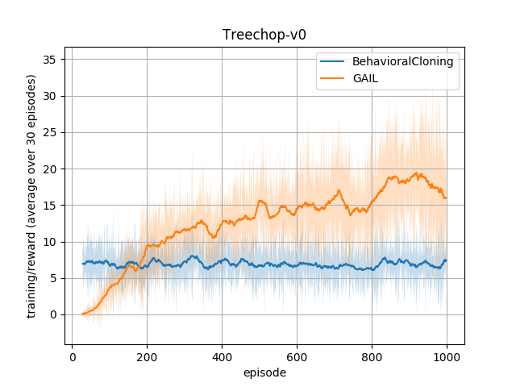

The figure above shows the performance of the algorithms during the training phase on the `MineRLTreechop-v0` task.
Settings are same as those of the previous section.
For BC, we shows the performance over episodes of the agent pretrained by expert dataset instead.

BC outperforms [original paper](https://arxiv.org/abs/1904.10079)'s BC value 0.75 +- 0.39.
For GAIL, it outperforms some of RL agents but lower than PPO result, which is contained in GAIL policy.
Note that GAIL uses less prior knowledge than RL agents, which only uses camera discretization.
Details of settings are shown in later sections.

Videos of trained agents during their last evaluation round:
- [Behavioral Cloning trial 1 (reward 17.0)](static/release_bc_gail/BehavioralCloningTreechop1.mp4)
- [Behavioral Cloning trial 2 (reward 15.0)](static/release_bc_gail/BehavioralCloningTreechop2.mp4)
- [Behavioral Cloning trial 3 (reward 7.0)](static/release_bc_gail/BehavioralCloningTreechop3.mp4)
- (NA) GAIL trial 1 (reward 5.0)
- [GAIL trial 2 (reward 24.0)](static/release_bc_gail/GAILTreechop2.mp4)
- [GAIL trial 3 (reward 34.0)](static/release_bc_gail/GAILTreechop3.mp4)

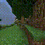
Behavioral Cloning trial 1 first 100 frames of the last evaluation episode

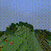
GAIL trial 3 first 100 frames of the last evaluation episode


## MineRLNavigateDense-v0

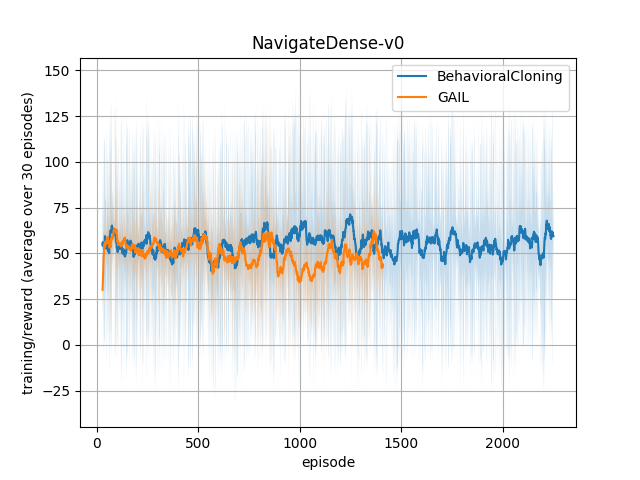

For `MineRLNavigateDense-v0`, both BC and GAIL outperform [original paper](https://arxiv.org/abs/1904.10079)'s BC result 5.57 +- 6.00, and are comparable to other RL agents.

Videos of trained agents during their last evaluation round:
- [Behavioral Cloning trial 1 (reward 14.8)](static/release_bc_gail/BehavioralCloningNavigateDense1.mp4)
- [Behavioral Cloning trial 2 (reward 13.7)](static/release_bc_gail/BehavioralCloningNavigateDense2.mp4)
- [Behavioral Cloning trial 3 (reward 15.4)](static/release_bc_gail/BehavioralCloningNavigateDense3.mp4)
- [GAIL trial 1 (reward 1.5)](static/release_bc_gail/GAILNavigateDense1.mp4)
- [GAIL trial 2 (reward 56.7)](static/release_bc_gail/GAILNavigateDense2.mp4)
- [GAIL trial 3 (reward 62.8)](static/release_bc_gail/GAILNavigateDense3.mp4)


Behavioral Cloning trial 3 first 100 frames of the last evaluation episode

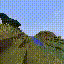
GAIL trial 3 first 100 frames of the last evaluation episode


## MineRLNavigate-v0

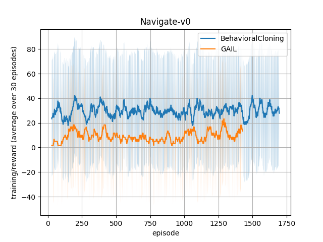

BC and GAIL show better performance than RL agents without expert dataset and [original paper](https://arxiv.org/abs/1904.10079)'s BC (4.23 +- 4.15).

Videos of trained agents during their last evaluation round:
- [Behavioral Cloning trial 1 (reward 100.0)](static/release_bc_gail/BehavioralCloningNavigate1.mp4)
- [Behavioral Cloning trial 2 (reward 0.0)](static/release_bc_gail/BehavioralCloningNavigate2.mp4)
- [Behavioral Cloning trial 3 (reward 0.0)](static/release_bc_gail/BehavioralCloningNavigate3.mp4)
- [GAIL trial 1 (reward 0.0)](static/release_bc_gail/GAILNavigate1.mp4)
- [GAIL trial 2 (reward 0.0)](static/release_bc_gail/GAILNavigate2.mp4)
- [GAIL trial 3 (reward 0.0)](static/release_bc_gail/GAILNavigate3.mp4)


Behavioral Cloning trial 1 first 100 frames of the last evaluation episode

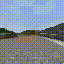
GAIL trial 2 first 100 frames of the last evaluation episode


## MineRLObtainDiamond-v0

BC/GAIL aren't able to solve `MineRLObtainDiamond-v0`, either.

## Data conversion

In order to utilize original dataset in our BC/GAIL settings, we employed following conversion procedures.

### Frame skipping

Since expert data have no `frameskip`, we compressed several frames (8 in experiments) to unified one.
Actions of a unified frame is replaced by one of compressed frames whose absolute value is maximum.

## Action space settings

For the action space, BC and GAIL have 3 options: `discrete`, `continuous`, and `multi-dimensional-softmax`.
These options represent one discrete action, a set of continuous actions, and a set of discrete actions respectively.
We employed the following action space conversion for each setting:

### Action space conversion

Since ranges of yaw, pitch `[-180, 180]` are quite large especially for GAIL, we limited them to `[-10, 10]` respectively.

BC uses `discrete` setting, which also converts overall action sets to a discrete action space.
It is basically same as those of RL agents, except that it has more candidates of camera actions (**camera discretization**).

For more information, see the **Discretization to a discrete action space** section below.

#### Camera discretization

In addition to camera range limitation, `discrete` and `multi-dimensional-softmax` settings uses the camera discretization.
We converted this continuous range to equally spaced discrete actions.

- In these experiments, we modified to 7 discrete actions. (i.e., `-10`, `-6.66`, `-3.33`, `0`, `3.33`, `6.66`, and `10`).

This value is specified by `--num-camera-discretize`. **NOTE THAT THIS VALUE MUST BE AN ODD NUMBER.**

#### Discretization to a discrete action space

On the `discrete` setting, expert actions are converted to only one action.
The converted action is selected based on a sequence of conditions, which compare the value of the corresponding element with certaion threshold.
If more than 1 conditions are satisfied. It selects an action based on the following order:

- `nearbyCraft`, `nearbySmelt`, `craft`, `equip`, `place`, `camera`, `forward`, `back`, `left`, `right`, `jump`, `sneak`, `sprint`, `attack`

You can control the order of conditions by using the `--prioritized-elements` option.
If one of conditions specified in `--prioritized-elements` is `True`, then it precedes the original priorities.
Ties are broken by the order of `--prioritized-elements`.


#### Pitch control

In BC, pitch control is disabled by default. This parameter can be modified by the `--allow-pitch` option.

# Experimental results of DQfD

The figures below show the *training* reward graphs for each of DQfD with task-specific prior knowledge used to shape the action and observation space.

The exact hyperparameters used for each algorithm can be found from the links in the "Getting Started" section and their corresponding Python scripts (`baselines/train_dqfd.py`).

## MineRLTreechop-v0

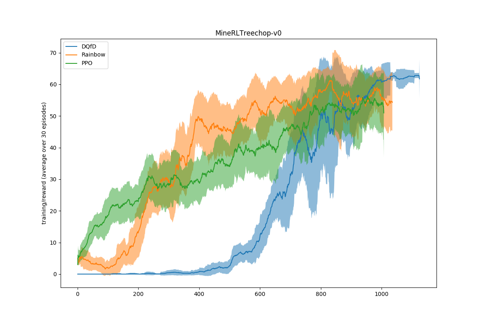

The figure above shows the performance of the algorithms during the training phase on the MineRLTreechop-v0 task. Each algorithm is trained once, and the shaded area represents the standard deviation over the last 30 episodes.

Similarly to BC/GAIL we use a camera range limitation and convert the continuous range to equally spaced discrete actions. An additional improvement can be obtained with different amounts of camera actions, so this is something you could try to tune for other environments.

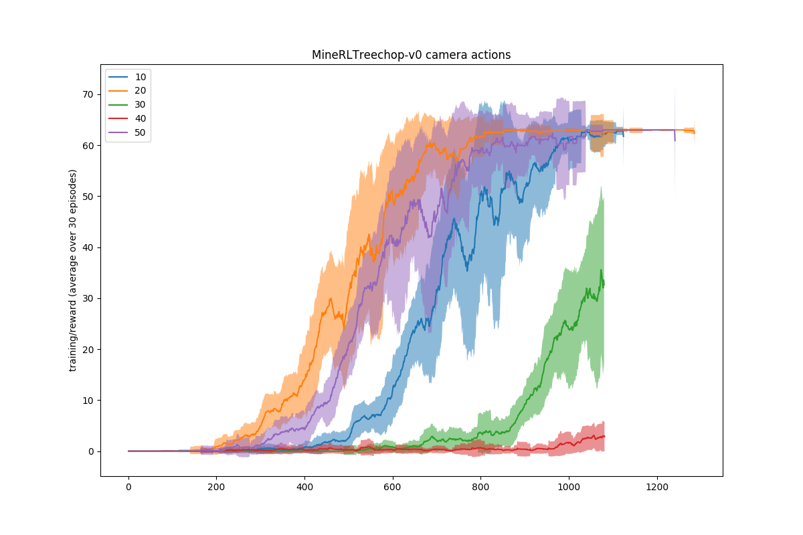

## MineRLNavigate-v0

In the MineRLNavigate-v0 environment we also tried different amounts of camera actions and different amounts of expert demonstrations, but were unable to solve the task.

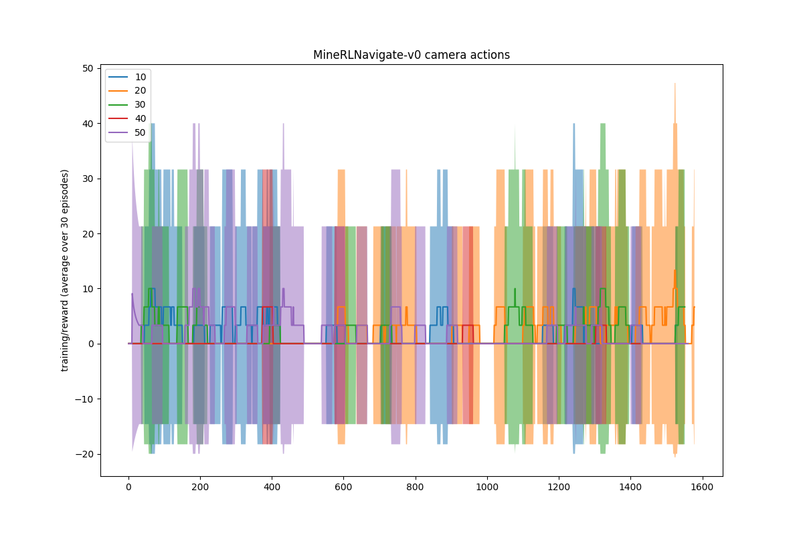

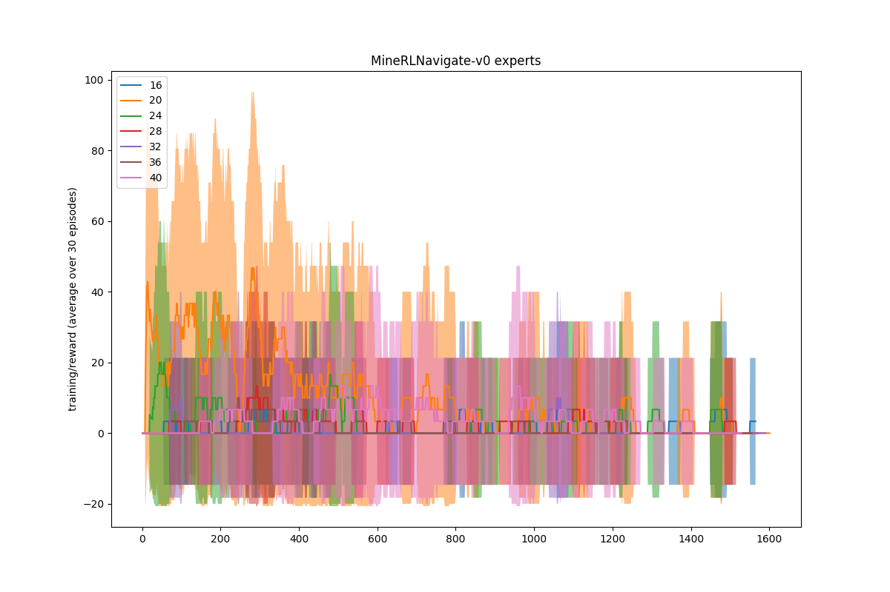

## MineRLObtainDiamond-v0 and MineRLObtainDiamondDense-v0

DQfD is unable to solve both MineRLObtainDiamond-v0 and MineRLObtainDiamondDense-v0

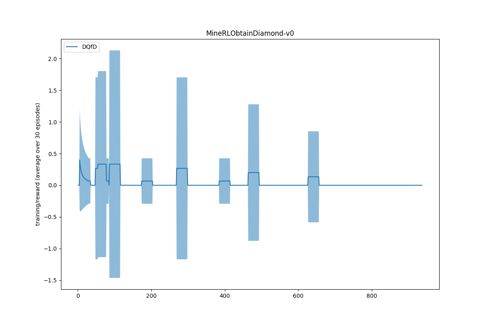

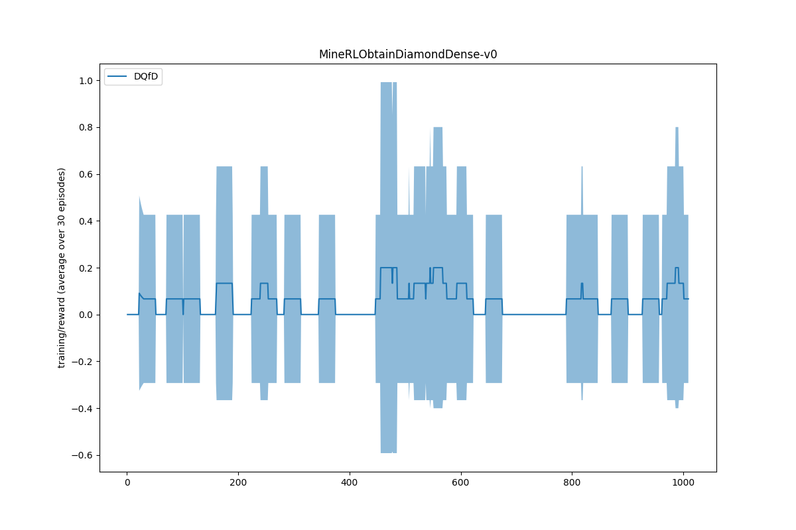

## Action Branching architecture

To handle MineRL's large action space we use an [Action Branching architecture](https://arxiv.org/abs/1711.08946) which gives us a way of decomposing the action space, in particular, our architecture has 5 branches at most (depending on the environment it could have less):

- back/forward/left/right
- attack/sneak/sprint/jump
- First camera dimension
- Second camera dimension
- craft/equip/nearbyCraft/nearbySmelt/place
