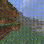

# MineRL Competition's baseline implementation with ChainerRL

This repository contains a set of baselines implementations to help you get started with the [MineRL](https://github.com/minerllabs/minerl) competition. These implementations were adapted from  [ChainerRL](https://github.com/chainer/chainerrl) and use [Chainer](https://chainer.org/).

# Resources
- [MineRL](https://github.com/minerllabs/minerl)
  - [Competition page](https://www.aicrowd.com/challenges/neurips-2019-minerl-competition)
  - [Documentation](http://minerl.io/docs/)
  - [Competition Proposal Paper](https://arxiv.org/abs/1904.10079)
- [ChainerRL](https://github.com/chainer/chainerrl)
- [Chainer](https://chainer.org/)

# Installation

```sh
git clone git@github.com:minerllabs/baselines.git
cd baselines/general/chainerrl
pip install -r requirements.txt
```

See [MineRL installation](https://github.com/minerllabs/minerl#installation) and
[ChainerRL installation](https://github.com/chainer/chainerrl#installation) for more information.

# Getting started

- [baselines/dddqn.sh]
    - Double Dueling DQN (DDDQN), with implementation and hyperparameters as described in the [proposal paper](https://arxiv.org/abs/1904.10079) (code: [here](https://github.com/minerllabs/minerl/blob/master/tests/excluded/navigate_dqn_test.py) and [here](https://github.com/minerllabs/minerl/blob/master/tests/excluded/treechop_dqn_test.py)).
- [baselines/rainbow.sh]
    - Rainbow
- [baselines/ppo.sh]
    - PPO

# Experimental results of DDDQN/Rainbow/PPO

|                    | Treechop           | Navigate         | NavigateDense      |
| :---               | ---:               | ---:             | ---:               |
| (paper) DDDQN      | 3.73 +- 0.61       | 0.00 +- 0.00     | 55.59 +- 11.38     |
| (paper) A2C        | 2.61 +- 0.50       | 0.00 +- 0.00     | -0.97 +- 3.32      |
| (paper) BC         | 0.75 +- 0.39       | 4.23 +- 4.15     | 5.57 +- 6.00       |
| (paper) PreDQN     | 4.16 +- 0.82       | 6.00 +- 4.65     | **94.96 +- 13.42** |
| (**ours**) DDDQN   | 9.68 +- 5.28       | 5.00 +- 21.79    | 57.84 +- 50.74     |
| (**ours**) Rainbow | **60.39 +- 19.88** | 9.00 +- 28.62    | 66.48 +- 38.73     |
| (**ours**) PPO     | 38.44 +- 19.04     | 6.00 +- 23.75    | 80.84 +- 51.29     |
| (paper) Human      | 64.00 +- 0.00      | 100.00 +- 0.00   | 164.00 +- 0.00     |
| (paper) Random     | 3.81 +- 0.57       | 1.00 +- 1.95     | -4.37 +- 5.10      |

Talbe 1: (for "paper") Results over the best 100 contiguous episodes. +- denotes standard deviation.  
(for "ours") Results over the best 100 contiguous episodes among three trials. +- denotes standard deviation.  
We do not emphasize the best performance for Navigate since the standard deviation is very large.  
See Table 1 of [proposal paper](https://arxiv.org/abs/1904.10079) for more information.  
Note that our current implementation does not use trajectory data.


The figures below show the *training* reward graphs for each algorithm with task-specific prior knowledge used to shape the action and observation space.  
For experitments, we used **MineRL v0.1.18** which is the latest as of July 9, 2019.  

The exact hyperparameters used for each algorithm can be found from the links in the "Getting Started" section and their corresponding Python scripts (`baselines/dqn_family.py`, `baselines/ppo.py`).


## MineRLTreechop-v0


The figure above shows the performance of the algorithms during the training phase on the `MineRLTreechop-v0` task.
Each algorithm is independently trained 3 times (trials), and the shaded area represents the standard deviation (not the standard error) over the score of the three trials
The curves are smoothed by taking an average over 30 episodes for visibility.

Rainbow and PPO outperform DDDQN.

[The MineRL competition's original paper](https://arxiv.org/abs/1904.10079) reports the score of DDDQN (referred to as "DQN" in the paper) as 3.73 +- 0.61, which is consistent with our result. (Our result is slightly better than the original)

Note: for a fair comparison, the x-axis does not represent "timestep", but "episode". (because Rainbow and PPO use "frameskip" strategy while DDDQN follows the paper's settings (no frame skipping)).

Videos of trained agents during their last evaluation round:
- [Rainbow trial 1 (reward 58.0)](static/release20190708/RainbowTreechop1.mp4)
- [Rainbow trial 2 (reward 79.0)](static/release20190708/RainbowTreechop2.mp4)
- [Rainbow trial 3 (reward 41.0)](static/release20190708/RainbowTreechop3.mp4)
- [PPO trial 1 (reward 68.0)](static/release20190708/PPOTreechop1.mp4)
- [PPO trial 2 (reward 26.0) ](static/release20190708/PPOTreechop2.mp4)
- [PPO trial 3 (reward 54.0)](static/release20190708/PPOTreechop3.mp4)
- (NA) DDDQN trial 1
- [DDDQN trial 2 (reward 0.0?)](static/release20190708/DDDQNTreechop2.mp4)
- [DDDQN trial 3 (reward 1.0)](static/release20190708/DDDQNTreechop3.mp4)

  
Rainbow trial 2 first 100 frames

  
PPO trial 1 first 100 frames

  
DDDQN trial 3 first 100 frames


## MineRLNavigateDense-v0


For `MineRLNavigateDense`, DDDQN achieves a score comparable to Rainbow/PPO.

[The MineRL competition's original paper](https://arxiv.org/abs/1904.10079) reports the score of DDDQN (referred as "DQN" in the paper) as 55.59 +- 11.38, which is consistent with our result. (Our result is slightly worse than the original)

Videos of trained agents during their last evaluation round:
- [Rainbow trial 1 (reward ?)](static/release20190708/RainbowNavigateDense1.mp4)
- [Rainbow trial 2 (reward 52.6)](static/release20190708/RainbowNavigateDense2.mp4)
- [Rainbow trial 3 (reward 167.7)](static/release20190708/RainbowNavigateDense3.mp4)
- [PPO trial 1 (reward 165.9)](static/release20190708/PPONavigateDense1.mp4)
- [PPO trial 2 (reward 59.6)](static/release20190708/PPONavigateDense2.mp4)
- [PPO trial 3 (reward 65.1)](static/release20190708/PPONavigateDense3.mp4)
- [DDDQN trial 1 (reward 161.0)](static/release20190708/DDDQNNavigateDense1.mp4)
- [DDDQN trial 2 (reward 18.2)](static/release20190708/DDDQNNavigateDense2.mp4)
- [DDDQN trial 3 (reward 60.3)](static/release20190708/DDDQNNavigateDense3.mp4)

  
Rainbow trial 3 first 100 frames

  
PPO trial 1 first 100 frames

  
DDDQN trial 1 first 100 frames


## MineRLNavigate-v0


No algorithm could solve the `MineRLNavigate-v0` (a sparse reward task). Given the difficulties of utilizing RL algorithms for sparse reward tasks, we posit the need for additional methods such as reward shaping, smarter exploration strategies, utilizing expert trajectories, etc.

Videos of trained agents during their last evaluation round:
- [Rainbow trial 1 (reward 0.0)](static/release20190708/RainbowNavigate1.mp4)
- [Rainbow trial 2 (reward 0.0)](static/release20190708/RainbowNavigate2.mp4)
- [Rainbow trial 3 (reward 0.0)](static/release20190708/RainbowNavigate3.mp4)
- [PPO trial 1 (reward 0.0)](static/release20190708/PPONavigate1.mp4)
- [PPO trial 2 (reward 0.0)](static/release20190708/PPONavigate2.mp4)
- [PPO trial 3 (reward 0.0)](static/release20190708/PPONavigate3.mp4)
- [DDDQN trial 1 (reward 0.0)](static/release20190708/DDDQNNavigate1.mp4)
- (NA) DDDQN trial 2
- [DDDQN trial 3 (reward 0.0)](static/release20190708/DDDQNNavigate3.mp4)

  
Rainbow trial 1 first 100 frames

  
PPO trial 1 first 100 frames

  
DDDQN trial 1 first 100 frames


## MineRLObtainDiamond-v0

`MineRLObtainDiamond-v0` is the ultimate goal for this competition. None of the baselines discussed above were able to solve this task.

*Important notice*: the action space shaping strategy we tried for this task is different from
`MineRLTreechop-v0`, `MineRLNavigateDense-v0` or `MineRLNavigate-v0`.
The detail is described in the "Exclusive actions" section below.


## Prior knowledge for action/observation spaces

For `MineRLTreechop-v0`, `MineRLNavigateDense-v0` and `MineRLNavigate-v0`, Rainbow/PPO/DDDQN shape the action/observation space based on prior domain knowledge about the tasks.
This shaping was inspired by the [MineRL competition proposal paper's](https://arxiv.org/abs/1904.10079) implementations
([Treechop](https://github.com/minerllabs/minerl/blob/master/tests/excluded/treechop_dqn_test.py),
[Navigate](https://github.com/minerllabs/minerl/blob/master/tests/excluded/navigate_dqn_test.py)).

The action spaces for MineRL environments are defined using OpenAI Gym's `Dict` space.
The set of action_space keys are different among tasks, but some of them are common throughout
(namely, `forward`, `back`, `left`, `right`, `jump`, `sneak`, `sprint`, `attack` and `camera`).

`env_wrappers.SerialDiscreteActionWrapper` is the corresponding code for shaping the action space.

The following sections describe the various strategies we employed in the shaping of the action space.
### Discretizing

The only action key which is continuous is `camera`.
`camera` is discretized into two-kinds action (For DDDQN and Rainbow. PPO does not require a discrete action space):

```python
[(0, -10), (0, 10)]
```

### Disabling

Actions deemed unnecessary for the corresponding task were disabled.

There are two types of disabling.
`--always-keys` specifies actions which are always triggered throughout the episode.
These actions are removed from the agent's action choice.

Actions specified as `--exclude-keys` are simply disabled and they will be never triggered.

For example, 
On `MineRLTreechop-v0`,
  - `--always-keys`: `attack`
  - `--exclude-keys`: `back`, `left`, `right`, `sneak`, `sprint`

On `MineRLNavigate-v0` / `MineRLNavigateDense-v0`
  - `--always-keys`: `forward`, `sprint`, `attack`
  - `--exclude-keys`: `back`, `left`, `right`, `sneak`, `place`

### Serializing

After discretizing and disabling, the `Dict` action space is flattened and converted into a single `Discrete` action space.  
The resulting space is "serialized", i.e: agents can choose only one of the action on the flattened action space
(the agent can push only one button of the gamepad at a step).

### (Reversing)

On Treechop, `forward` key is reversed. (`--reverse-keys forward`)  
Reversed keys are similar to the `--always-keys` actions, but they are not removed from the agent's action choice.
Corresponding gamepad buttons for reversed actions are always pushed, but the agent can choose to trigger the button off as one of the action.

### Exclusive actions

For the `Obtain*` tasks, we employ "weak" action prior knowledge instead of prior knowledge described above.
It does not have `--always-keys`/`--exclude-keys`/`--reverse-keys` option,
but "exclusive" (or, "conflicting") actions are merged.

For example,
`forward` and `back` actions are exclusive since they conflict each other and pushing them at the same time makes no sense.
They are merged and renamed as `forward_back` action with Discrete(3).  
(Original: forward 0/1, back 0/1. Merged: noop/forward/back)

List of exclusive actions we used:
  - `forward` / `back`
  - `right` / `left`
  - `sneak` / `sprint`
  - `attack` / `place` / `equip` / `craft` / `nearbyCraft` / `nearbySmelt`

See `env_wrappers.CombineActionWrapper` for more detail.

### Summary

Resulting action spaces after shaped with prior knowledge are:

- Treechop: `Discrete(5)`
  1. (noop) `{'forward': 1, 'jump': 0, 'camera': [0, 0]}`
  2. `{'forward': 0, 'jump': 0, 'camera': [0, 0]}`
  3. `{'forward': 1, 'jump': 1, 'camera': [0, 0]}`
  4. `{'forward': 1, 'jump': 0, 'camera': [0, -10]}`
  5. `{'forward': 1, 'jump': 0, 'camera': [0, 10]}`  
  Note that `attack` is always `1` and `back`, `left`, `right`, `sneak`, `sprint` are always `0`.
- Navigate/NavigateDense: `Discrete(4)`
  1. (noop) `{'jump': 0, 'camera': [0, 0]}`
  2. `{'jump': 1, 'camera': [0, 0]}`
  3. `{'jump': 0, 'camera': [0, -10]}`
  4. `{'jump': 0, 'camera': [0, 10]}`  
  Note that `forward`, `sprint`, `attack` are always `1` and `back`, `left`, `right`, `sneak`, `place` are always `0`.
- Obtain*: `Discrete(36)`
